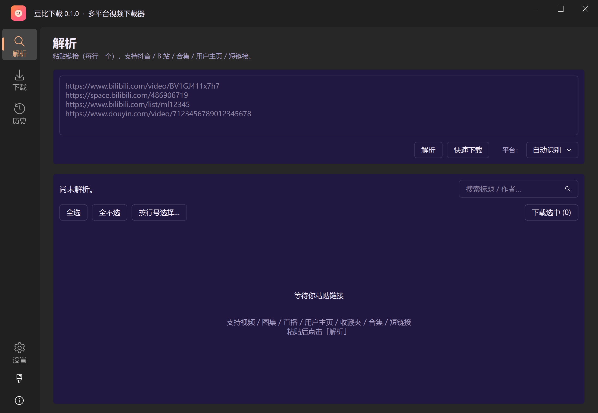
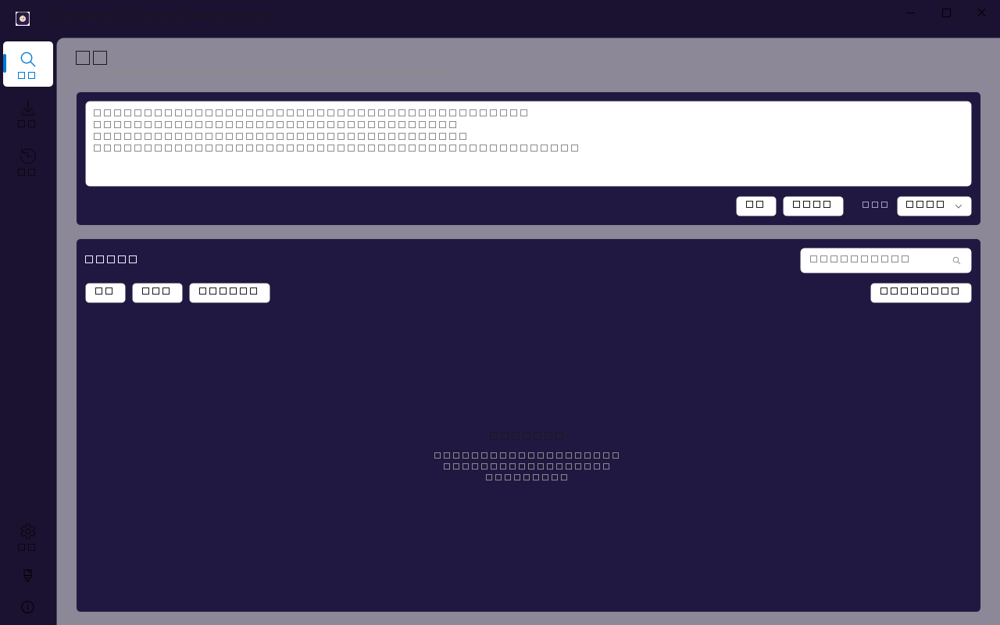
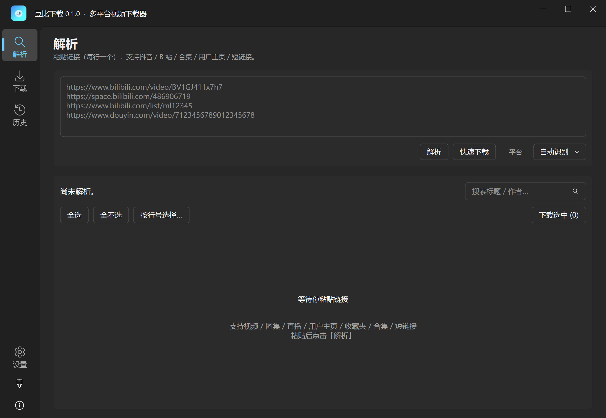
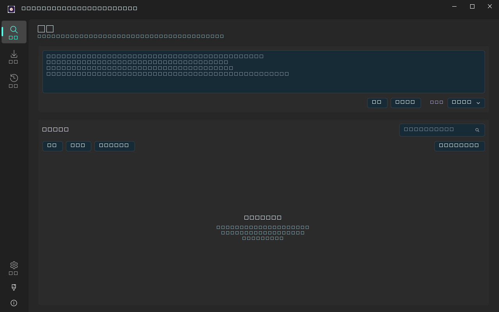
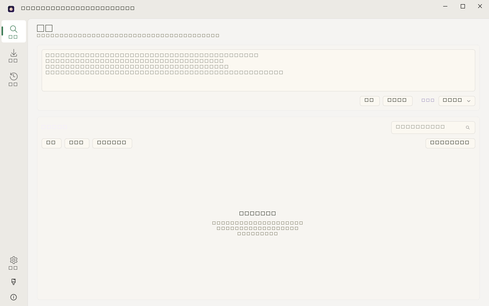

# DouBi

> 跨平台视频下载器内核 —— 一个 GUI + CLI + REST + MCP 多形态统一的多平台下载器，下载能力由 [yt-dlp](https://github.com/yt-dlp/yt-dlp) 提供。

<p align="center">
  
</p>

## 形态

| 形态 | 入口 | 状态 |
|---|---|---|
| 内核（库） | `doubi` | **✓** 平台无关内核 |
| CLI | `doubi download -u URL` | **✓** download / auth / live / migrate / platforms |
| REST 服务 | `doubi serve` | **✓** FastAPI + 内存任务队列 |
| 桌面 GUI | `doubi-gui` | **✓** PySide6 Fluent，7 套主题 |
| MCP 工具 | `doubi-mcp` | **✓** stdio JSON-RPC 2.0 |

## 支持平台

- ✅ **抖音**（单条 / 合集批量 / 用户作品 / 弹窗链接；合集列举走签名 Web API，下载走 yt-dlp）
- ✅ **B 站**（`Bili23-Downloader` 接入；下载走 yt-dlp）
- ✅ **YouTube**（watch / shorts / embed / live / youtu.be 短链；元数据走 yt-dlp `extract_info`，下载走 yt-dlp）
- ✅ **通用视频站**（silidm / sv.baidu.com 等任意 URL：Playwright 启动 Chromium 嗅探 `<video>` 与网络请求，抓出 `m3u8` 与真视频容器后缀的直链；解析列表**只显示视频容器**，不会把 ts/aac 分片混进结果里）
- 🚧 计划：TikTok 国际版 / 小红书 / 微博 / 快手

## 获取

### Windows 用户：直接装

仓库已内置便携版 NSIS，不需要额外安装打包工具，一条命令产出正式安装包：

```bash
python scripts/build_installer.py
```

正式分发有**两种一键运行形态**（不用装 Python，不用 Playwright install）：

| 形态 | 文件 | 体积（0.3.0） | 说明 |
|---|---|---|---|
| **NSIS 安装包**（推荐给普通用户） | `dist/DouBi-Setup-0.3.0.exe` | **441.31 MB** | 双击安装到 `%LOCALAPPDATA%\DouBi`，**无 UAC 弹窗**；开始菜单 + 桌面快捷方式；控制面板正常卸载；卸载零残留，`~/.doubi` 配置默认保留 |
| **Onefile 便携版**（推荐给 U 盘/网盘） | `dist/doubi-gui.exe` | **615.17 MB** | 单文件即跑，启动时自解压到 `%TEMP%/_MEIxxxxx`；免安装；机器之间直接拷 |
| Onedir 绿色目录（CI/内网分发） | `dist/doubi-gui/` | ~1.5 GB / 4003 文件 | **启动最快**；直接 zip 打包即可发布"绿色版" |

> 体积为什么这么大？**安装包里已经带上了 Playwright Chromium 浏览器目录**
> （通用视频站嗅探的核心依赖）+ PySide6/Fluent 完整样式资源。如果只
> 用 B 站 / YouTube 内置 yt-dlp 解析、不需要通用 Playwright 嗅探，可以在
> `scripts/build_exe.py` 里去掉 ms-playwright 的 `--add-data`，体积大约砍 60%。

#### 下载后的 SHA256 校验（推荐做）

每次发布 `dist/` 目录里都会生成三份侧签文件：`SHA256SUMS.txt`、
`doubi-gui.exe.sha256`、`DouBi-Setup-0.3.0.exe.sha256`。Windows PowerShell
一键对比（无需安装任何软件）：

```powershell
# 方式 1：Get-FileHash（推荐）
$expected = (Get-Content dist\DouBi-Setup-0.3.0.exe.sha256).Trim()
$actual   = (Get-FileHash dist\DouBi-Setup-0.3.0.exe -Algorithm SHA256).Hash.ToLower()
$expected -eq $actual    # $true = 通过

# 方式 2：certutil（老 Win 机器也有）
certutil -hashfile dist\doubi-gui.exe SHA256
```

#### 首次运行「翻译正常」自检 2 条（10 秒确认包是好的）

0.3.0 曾出现过「打包漏加 i18n JSON 导致 GUI 显示英文 key」的 bug（见
CHANGELOG G7），新包到手后跑两条就能确认没回归：

1. **标题栏**：应为「**豆比下载 0.3.0 · 多平台视频下载器**」。如果末尾是
   `app.title_suffix` 这种英文 key → 包坏了，换一个新的。
2. **左侧导航**：从上到下应为「**解析 / 下载 / 历史 / 设置**」。如果看到
   `nav.parse` / `av.downloads` / `nav.history` / `nav.settings` → 同样是
   i18n 资源没打进去。

首次打包（LZMA 压缩 1.5 GB，单线程）耗时约 **3–6 分钟**，详细参数、打包期
两条硬规则（DatablockOptimize off + wait_stable 10s）、发布期验证清单
见 [docs/BUILD.md](docs/BUILD.md)。

> 推 tag `v*` 后 GitHub Actions 会自动跑测试 + 打包 + 上传安装包并附 SHA256 校验到
> GitHub Release（draft），见 [`.github/workflows/build.yml`](.github/workflows/build.yml)。

### 开发者：从源码装

```bash
# 1) 基础内核 + CLI
pip install -e .

# 2) 桌面 GUI（PySide6 Fluent）
pip install -e ".[gui]"

# 3) REST 服务
pip install -e ".[server]"

# 4) 全装
pip install -e ".[all]"
```

## 快速使用

```bash
# 列出支持的平台
doubi platforms

# 下载单条
doubi download -u "https://www.bilibili.com/video/BV1xx411c7mD" -o ./Downloaded

# 下载抖音
doubi download -u "https://www.douyin.com/video/7123456789012345678" -o ./Downloaded

# 下载 YouTube（watch / shorts / youtu.be 短链均可）
doubi download -u "https://www.youtube.com/watch?v=dQw4w9WgXcQ" -o ./Downloaded
doubi download -u "https://youtu.be/dQw4w9WgXcQ" -o ./Downloaded

# 批量下载抖音合集（APP 分享的 iesdouyin 链接同样支持）
doubi download -u "https://www.douyin.com/collection/7647083357288957995" -o ./Downloaded
```

启动图形界面：

```bash
doubi-gui

# 本次启动指定主题（default_light / default_dark / doubi / deep_sea / morandi / eye_care / high_contrast）
doubi-gui --theme deep_sea
```

## 主题

GUI 自带 7 套主题包，每套都有自己的底色、文字色与语义色，切换后**整个界面即时生效**
（含切换之后才弹出的对话框和菜单）：

| 主题 | 界面显示 | 底色 |
|---|---|---|
| `default_light` | 默认亮 | 浅灰白 |
| `default_dark` | 默认暗 | 深灰 |
| `doubi` | 豆比紫 | 深紫 |
| `deep_sea` | 深海 | 墨蓝 |
| `morandi` | 莫兰迪 | 暖米灰 |
| `eye_care` | 护眼 | 米黄 |
| `high_contrast` | 高对比 | 纯黑 + 亮黄 |

> 表格顺序即设置页下拉框的顺序：两套系统默认主题排在最前面方便取用，
> 品牌主题 `doubi` 紧随其后。

<p align="center">
  
  
</p>
<p align="center">
  
  
</p>

`doubi` 是品牌主题——配色直接取自应用图标（深紫底 + 琥珀橙主色），
`set_theme("doubi")` 拿到的是原图配色而不是「亮/暗 + 强调色」的近似。

三种切换方式：设置页下拉框、导航栏画笔按钮（循环切换）、启动参数 `--theme`。
**只有在设置页点「保存设置」才会记住**，另两种只在本次运行生效。
详见 [docs/QUICKSTART.md](docs/QUICKSTART.md) 的「换主题」一节。

## GUI 体验提示

几个值得专门提的 0.3.0 行为：

- **窗口默认居中**：启动时落在主屏可用区域的中心（已扣掉任务栏），不会缩在左上角
- **解析列表只显示真视频**：`.m3u8 / .mp4 / .mkv / .flv / .webm / .mov / .avi / .m4v`
  才进解析表，HLS 分片（`.ts / .aac / .m4s / .mpd`）全部过滤掉，避免一个视频站
  页面列出几十条没用的 ts 片段
- **已完成的文件被你手动删了？「重新下载」一键复活**：下载页「已完成」tab
  会在刷新时检查磁盘真实文件，缺失的任务会显示「缺失」徽标 + 「文件已删除」
  文字，右侧按钮变成 **重新下载**（和失败/取消任务的「重试」区分开），点击直
  接重排进下载队列——不需要再回去解析一遍页面
- **程序异常不会悄无声息闪退**：Qt 槽 / asyncio 任务里未捕获的异常会落完整
  traceback 到日志（和默认 stderr），不会直接消失进程

## 数据与配置

| 内容 | 位置 | 说明 |
|---|---|---|
| 配置文件 | `~/.doubi/config.yml` | GUI 设置页「保存设置」与 CLI 读的是同一份 |
| 登录 Cookie | `~/.doubi/cookies/*.txt` | Netscape 格式，直接喂给 yt-dlp |
| 下载记录库 | `doubi.db` | SQLite，去重 + 历史 |
| 下载清单 | `download_manifest.jsonl` | 每行一条 JSON，便于外部工具消费 |

> `doubi.db` 与 `download_manifest.jsonl` 默认是**相对路径**，落在当前工作目录，
> 不在 `~/.doubi` 里。想固定位置就在 `config.yml` 写绝对路径
> （`database_path` / `manifest_path`），传空字符串则关闭该功能。

卸载安装版时，`~/.doubi` 默认**保留**，重装后配置与登录状态还在；确实要清空，
在卸载界面勾选对应选项。

## 项目结构

```
DouBi/
├── pyproject.toml
├── INTEGRATION_PLAN.md            # 详细整合方案
├── src/doubi/
│   ├── core/                      # 平台无关内核
│   │   ├── models.py              # MediaItem / Stream / DownloadJob
│   │   ├── registry.py            # PlatformRegistry
│   │   ├── pipeline.py            # 解析→派发→下载→后处理
│   │   ├── config.py              # 配置加载
│   │   └── logger.py
│   ├── engines/                   # 下载引擎适配（yt-dlp / aria2 / native）
│   │   ├── base.py
│   │   └── yt_dlp.py
│   ├── platforms/                 # 平台适配器
│   │   ├── base.py                # PlatformAdapter ABC
│   │   ├── douyin/                # 抖音
│   │   ├── bilibili/              # B 站
│   │   └── youtube/               # YouTube
│   ├── cli/                       # 命令行
│   │   └── main.py
│   ├── server/                    # REST（FastAPI）
│   │   ├── app.py
│   │   ├── jobs.py                # JobManager 内存任务队列
│   │   └── schemas.py
│   ├── ui/                        # PySide6 GUI
│   │   ├── app.py                 # 入口（--theme）
│   │   ├── main_window.py
│   │   ├── theme.py               # 7 套主题包 / token 表 / set_theme
│   │   ├── resources/             # SVG 图标模板 + 主题换色 + 多档位 QIcon
│   │   ├── widgets.py             # 共享组件（PageHeader / EmptyState / ...）
│   │   ├── splash.py              # 闪屏
│   │   ├── task_manager.py        # 暂停 / 继续 / 取消
│   │   ├── pages/                 # parse / download / history / settings
│   │   └── dialogs/               # login_dialog.py / about_dialog.py
│   └── mcp/                       # MCP 工具（stdio JSON-RPC）
│       └── server.py
├── scripts/                       # 构建脚本
│   ├── build_ico.py               # SVG → 多尺寸 .ico
│   ├── build_exe.py               # PyInstaller onedir 打包
│   └── build_installer.py         # 调 NSIS 生成安装程序
├── installer/
│   └── doubi.nsi                  # NSIS 安装脚本（免 UAC / 中文界面 / 零残留卸载）
├── tools/nsis/                    # 内置便携版 NSIS，clone 下来即可打包
├── screenshots/                   # 文档用截图
├── docs/                          # 见下方「文档」表
└── tests/                         # 27 个测试文件，676 条用例
```

> 仓库里不含 `Bili23-Downloader-main/` 与 `douyin-downloader-main/` 这两个被整合的
> 上游源码目录（`.gitignore` 已排除）。它们只是移植时的参考物，运行和构建都不依赖，
> 需要对照时按「整合来源」一节的链接自行下载。

## 文档

| 文档 | 内容 |
|---|---|
| [docs/QUICKSTART.md](docs/QUICKSTART.md) | 装完之后怎么用：CLI / GUI / REST / MCP、换主题、配置项 |
| [docs/ARCHITECTURE.md](docs/ARCHITECTURE.md) | 分层、数据流、存储 schema、任务生命周期、主题生效链路 |
| [docs/DEVELOPMENT.md](docs/DEVELOPMENT.md) | 开发约定、各模块要点、主题系统内幕、图标管线、打包、测试清单 |
| [docs/CHANGELOG.md](docs/CHANGELOG.md) | 里程碑与缺陷复盘（根因 / 修法 / 判据） |
| [docs/ICONS.md](docs/ICONS.md) | 图标管线（SVG 模板 / 主题换色 / 多档位 QIcon） |
| [docs/UI_DESIGN.md](docs/UI_DESIGN.md) | UI 设计语言：5 条视觉原则、7 套主题包配色表、token 与共享组件规范 |
| [docs/BUILD.md](docs/BUILD.md) | 打包全流程：`.ico` 生成、PyInstaller onedir、NSIS 安装包、踩坑记录 |
| [INTEGRATION_PLAN.md](INTEGRATION_PLAN.md) | 原始整合方案 |

## 整合来源

- `douyin-downloader-main` —— URL 解析、命名规则、清单文件、Cookie 编排、UI 入口
- `Bili23-Downloader-main` —— 桌面 GUI（Fluent Design）、MCP、命名规则引擎、附加产物（弹幕/字幕/NFO）
- `yt-dlp` —— 实际下载与媒体探测引擎

## 许可

GPL-3.0。详见 `LICENSE`。

## 致谢

- [jiji262/douyin-downloader](https://github.com/jiji262/douyin-downloader)（MIT）
- [ScottSloan/Bili23-Downloader](https://github.com/ScottSloan/Bili23-Downloader)（GPL-3.0）
- [yt-dlp/yt-dlp](https://github.com/yt-dlp/yt-dlp)（Unlicense）
